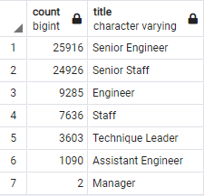

# Pewlett-Hackard-Analysis

## Introduction

The purpose of this analysis is to query the Pewlett-Hackard employee data tables to determine the number of potential retirements , within the Pewlett-Hackard organization to determine the potential impact to the organization.

The query with return the impact to the organization based on current employees titles.

A further query has developed to determine employees that are potentioal candidates for mentorship.

The queries developed will help identify major factors within the emmployee data that will allow management to make decisions to mitigate the impact of the high number or retirements. 

## Query results analysis

From the queries we can determine the following :- 

### 1. Total number retiring and current employees

The total number of potential retiress is : 72458
The total number of current employees     : 240124

### 2. Percentage impact on organization

Based on the number in item 1. above we can determine that the overall impact to the organization is approximately : 30%

### 3. Mentorship eligibility

The total number that qualify for mentorship eligibility : 1549

### 4. Mentorship V Retirement Percentactage

Based on the above data we can determine that the percentage eligible compared to the number retiring is approximately : 2%

## Summary

Based on the queries and the above key points it can be determined that the total number of position that needs filled would be approximately 72000 , this is approximately a 30% impact on the organization.

Based on the above there are approximately 1500 eligible for the mentorship program , and is only approximately 2% of the number retiring , this indicates that there is not sufficient eligible for the mentorship program to to mentor the next generation of Pewlett-Hackard employees.
